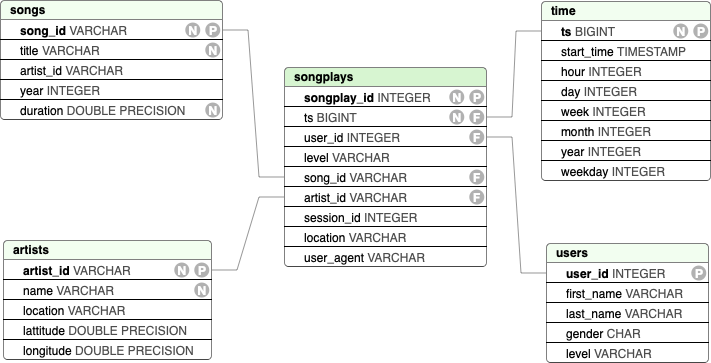

# Project: Data Warehouse
This project is a continuation of the previous two ones, which were concerned with the implementation of an ELT-pipeline for the data analystics team of the fictional music and audio streaming startup *Sparkify LLC*. The analytics team is interested in different business related-questions, such as what songs the individual users are listening to, in order to make them recommendations for new songs and artists.

After having dealt with the modeling of a OLAP-database and the establishing of ETL-processes on simple clients (PostGres-database and), it is now our turn to move into the cloud and establish an ETL-pipeline which is closer to the large-scale use-cases, a data engineer encounters in real business scenarios.
The second is the creation of a ETL-process which takes the raw data and transforms and inserts it into the newly created analytical database.

The raw data consists of the two already familiar documents-based JSON-datasets `log_data` and `song_data`. This time however, the datasets are stored in two AWS S3-buckets in the region `us-west-2` ("Oregon"), instead of being stored locally on the client. Furthermore, the target database shall not be stored within a local database server, but within a cloud-based Redshift cluster.

Hence, it is our task to design an ETL-pipeline (to be more precise *ELT*-pipeline) which extracts the datasets from the S3-buckets, stores them temporarily in two staging tables within the data warehouse, and only then transforms them and saves them in their respective target tables.


## Quick Start
In order to create the database and both the analytical and staging tables, launch the python (>=3.6.3) script from a terminal:
```console
foo@bar:~$ python create_tables.py
```
The ELT-process can be started by lauching:
```console
foo@bar:~$ python etl.py
```


## ELT-Pipeline
The final ETL-pipeline which populates the analytical database is implemented in `etl.py` and consists of stages:

 1. Process raw song data,
 2. Process raw log data.

In the first stage, the song data is imported using `Pandas` and converted to a Python-`list`, selecting only a subset of five attributes which are necessary to fill `songs_dim`. The same is done with `artists_dim`, selecting also a subset of five attributes from the raw data and inserting into the table using a `for`-loop.

The second stage is more interesting. Firstly, the tables `time_dim` and `user_dim` are being populated. In order to populate `time_dim`, the timestamp `ts` from the log data is extracted and transformed using Pandas into the appropriate tuple 
```
('timestamp', 'hour', 'day', 'week of year', 'month', 'year', 'weekday')
```
Then, we insert `user_dim` in the direct way again, only selecting the specified columns from the log data, as we have done in the two dim-tables in the first stage. 

Finally, `fact_songs` is being populated by making an inner join of `artists_dim` with `songs_dim` on the common attribute `artist_id`.




## Repository
This repository contains the following files and directories:

```
├── images/
├── dwh.cfg
├── create_tables.py
├── etl.py
├── sql_queries.py
└── README.md
```

 - `images/`: Contains images for this README file.

 - `dwh.cfg`: Configuration file for the python config module. Contains access information for the Redshift datawarehouse, IAM-role, and S3-bucket. *The values were left intentionally black for this public repository.* 

 - `create_tables.py`: Contains the functions `drop_tables()` and `create_tables()` to drop and create the staging and analytical databases. Finally, a `main()`-function establishes a connection to the data warehouse and subsequently calls these two functions, i.e. drops and creates the tables again.

- `sql_queries.py`: This file contains a collection of SQL query commands, encoded as python strings, which are organized into four blocks: `DROP_TABLES`, `CREATE_TABLES`, `STAGING TABLES`, `FINAL TABLES`. Finally, four lists of SQL commands, `create_list_queries`, and `drop_table_queries`, `drop_table_queries`, and `insert_table_queries` are formed which are used by the ``create_tables.py`.

 - `etl.py`: `process_song_file()` `process_log_file()` `process_data()`. Finally, the `main()`-function knits everything together.

 - `README.md`: The file you are currently reading.


# [Optional] Example Queries

## List all songs in songs_dim
List song titles and Ids:
```sql
    SELECT title, song_id
    FROM songs_dim
```
Number of song entries in table:
```sql
    SELECT COUNT(*) FROM songs_dim
```
The full songs_dim table lists 71 titles (cf. notebook).

## List all artists in artists_dim
List artist name and Ids:
```sql
    SELECT name, artist_id
    FROM artists_dim
```
Number of artist entries in table:
```sql
    SELECT COUNT(*)
    FROM artists_dim
```
The full artists_dim table lists 69 artists (cf. notebook).


## Number of songplays with identifiable song title and artist
Extract the songplays by a user:
``` sql
    SELECT COUNT(logs.songplay_id), songs.title, logs.song_id, artists.name AS num_of_plays
    FROM songplays_fact AS logs
    INNER JOIN songs_dim AS songs ON logs.song_id = songs.song_id
    INNER JOIN artists_dim AS artists ON logs.artist_id = artists.artist_id
    GROUP BY logs.song_id, songs.title, artists.name
    ORDER BY COUNT(logs.songplay_id)
```
In the full database, this query yields only one singl result, namely: 
```
[(1, 'Setanta matins', 'SOZCTXZ12AB0182364', 'Elena')]
```
**This means that there is only one songplay in the logs for which we can both identify the song name and/or artist.** This is an artifact of the fact that we are working with a subset of the whole database as it was indicated in the project instructions.
Unfortunately, this also means that querying the number of songplays for almost any of the songs in `songs_dim` or the artists in `artists_dim` will yield empty results.

**Note:** We have added a similar query named as Custom check in test.ipynb.

## Calculate the average duration of a song
A sensible way for Sparkify's analytical team to query the platform's user behavior would be to measure their respective "screentimes". Since it is currently not possible to determine the song duration for all songplays we can make a guess instead, and calculate the average song duration. We take this average duration for each songplay.

Calculate the average songplay duration:
```sql
    SELECT AVG(duration)
    FROM songs_dim
```
The result is:
```
[(Decimal('239.7296760563380282'),)]
```
When ETL'ing the full dataset, we obtain the average song duration of **239.7 seconds**.

## Individual user's average screentime per day
Extract the songplays by a user and rank them by the number of songplays:
``` sql
    SELECT logs.user_id, users.last_name, users.first_name, t.year, t.month, t.day, t.hour,
    239.7 * COUNT(logs.songplay_id) AS time_spent
    FROM songplays_fact AS logs
    INNER JOIN users_dim AS users ON logs.user_id = users.user_id
    INNER JOIN time_dim AS t ON logs.start_time = t.starttime
    GROUP BY logs.user_id, users.last_name, users.first_name, t.year, t.month, t.day, t.hour
    ORDER BY logs.user_id, users.last_name, users.first_name, t.year, t.month, t.day, t.hour
```
The result of this query is shown in the attached notebook. 

Notice how each result is a multiple of 239.7. Of course, this method will be more accurate for heavy users, but we believe it is still a good guess under these circumstances.

