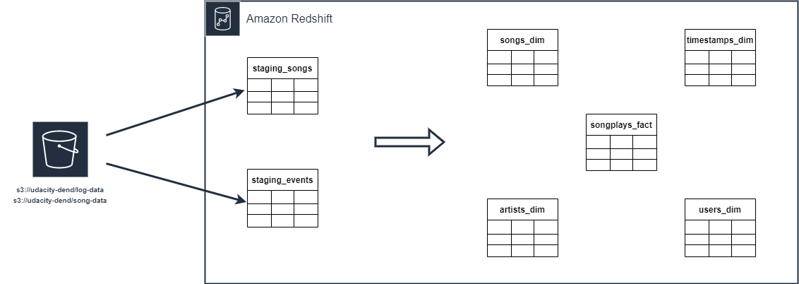

# Project: Data Warehouse
This project is a continuation of the previous two ones, which were concerned with the implementation of an ELT-pipeline for the data analystics team of the fictional music and audio streaming startup *Sparkify LLC*. The analytics team is interested in different business related-questions, such as what songs the individual users are listening to, in order to make them recommendations for new songs and artists.

After having dealt with the modeling of a OLAP-database and the establishing of ETL-processes on simple clients (local PostGres- and Cassandra-databases), it is now our turn to move into the cloud and establish an ETL-pipeline which is closer to the large-scale use-cases a data engineer encounters in real-world business scenarios.

The raw data consists of the two already familiar documents-based JSON-datasets `log_data` and `song_data`. This time however, the datasets are stored in a AWS S3-bucket in the region `us-west-2` ("Oregon"). Furthermore, the target database shall not be hosted within a local database server, but within a cloud-based AWS Redshift cluster.

Hence, it is our task to design an ETL-pipeline which extracts the datasets from the S3-buckets, stores them temporarily in two staging tables within the data warehouse, and only then transforms them and saves them in their respective target tables.


## Quick Start
In order to create the database and both the analytical and staging tables, launch the python (>=3.6.3) script from a terminal:
```console
foo@bar:~$ python create_tables.py
```
The ELT-process can be started by lauching:
```console
foo@bar:~$ python etl.py
```


## ELT-Pipeline
The ETL-pipeline which populates the analytical database is implemented in `etl.py` and consists of two stages:

 1. Copy the raw song and log data to two *staging tables*,
 2. Transform and insert the data into the analytical OLAP-tables.

In the first stage, the song and log-data is being parsed and copied from the S3-bucket to the two staging tables by utilizing the PostGres-`COPY` statement. The main difficulty here is to define the data types of the staging tables generic enough such that the data can be transferred without interruption.



The second stage is more interesting. This time, we populate the fact table, `songplays_fact`, first, then followed by `users_dim` and `songs_dim`. Finally, the tables `artists_dim` and `timestamps_dim` are being loaded. In order to populate `time_dim`, the 64-bit integer `ts` from the log data, measuring the amount of milliseconds which have passed since 01/01/1970, is extracted and transformed into the PostGres `TIMESTAMP`-type from which we can breakdown the starting time of songplays into more easily readable time components. In the end, the schema of `time_dim` is as follows:
```
('ts', 'timestamp', 'hour', 'day', 'week of year', 'month', 'year', 'weekday')
```
The entity relationship diagram of the target database is then given by:


## Repository
This repository contains the following files and directories:

```
├── images/
├── dwh.cfg
├── create_tables.py
├── etl.py
├── sql_queries.py
└── README.md
```

 - `images/`: Contains resources for this README file.

 - `dwh.cfg`: Configuration file for the python config module. Contains access information for the Redshift datawarehouse, IAM-role, and S3-bucket. *The values were left intentionally black for this public repository.* 

 - `create_tables.py`: Contains the functions `drop_tables()` and `create_tables()` to drop and create the staging and analytical databases. Finally, a `main()`-function establishes a connection to the data warehouse and subsequently calls these two functions, i.e. drops and creates the tables again.

- `sql_queries.py`: This file contains a collection of SQL query commands, encoded as python strings, which are organized into four blocks: `DROP_TABLES`, `CREATE_TABLES`, `STAGING TABLES`, `FINAL TABLES`. Finally, four lists of SQL commands, `create_list_queries`, and `drop_table_queries`, `copy_table_queries`, and `insert_table_queries` are formed which are used by the ETL-scripts.

 - `etl.py`: Contains the functions that call the two stages of the ETL-process:
    - Stage 1: `load_staging_tables()` ,
    - Stage 2: `insert_tables()`. 

    Finally, the `main()`-function knits everything together such that the script may be called from the console.

 - `README.md`: The file you are currently reading.


# [Optional] Example Queries

## List all songs in songs_dim
List song titles and Ids:
```sql
    SELECT title, song_id
    FROM songs_dim
```
Number of song entries in table:
```sql
    SELECT COUNT(*) FROM songs_dim
```
The full songs_dim table lists 71 titles (cf. notebook).

## List all artists in artists_dim
List artist name and Ids:
```sql
    SELECT name, artist_id
    FROM artists_dim
```
Number of artist entries in table:
```sql
    SELECT COUNT(*)
    FROM artists_dim
```
The full artists_dim table lists 69 artists (cf. notebook in project 1).


## Number of songplays with identifiable song title and artist
Extract the songplays by a user:
``` sql
    SELECT COUNT(logs.songplay_id), songs.title, logs.song_id, artists.name AS num_of_plays
    FROM songplays_fact AS logs
    INNER JOIN songs_dim AS songs ON logs.song_id = songs.song_id
    INNER JOIN artists_dim AS artists ON logs.artist_id = artists.artist_id
    GROUP BY logs.song_id, songs.title, artists.name
    ORDER BY COUNT(logs.songplay_id)
```
In the full database, this query yields only one singl result, namely: 
```
[(1, 'Setanta matins', 'SOZCTXZ12AB0182364', 'Elena')]
```
**This means that there is only one songplay in the logs for which we can both identify the song name and/or artist.** This is an artifact of the fact that we are working with a subset of the whole database as it was indicated in the project instructions.
Unfortunately, this also means that querying the number of songplays for almost any of the songs in `songs_dim` or the artists in `artists_dim` will yield empty results.

**Note:** We have added a similar query named as Custom check in test.ipynb.

## Calculate the average duration of a song
A sensible way for Sparkify's analytical team to query the platform's user behavior would be to measure their respective "screentimes". Since it is currently not possible to determine the song duration for all songplays we can make a guess instead, and calculate the average song duration. We take this average duration for each songplay.

Calculate the average songplay duration:
```sql
    SELECT AVG(duration)
    FROM songs_dim
```
The result is:
```
[(Decimal('239.7296760563380282'),)]
```
When ETL'ing the full dataset, we obtain the average song duration of **239.7 seconds**.

## Individual user's average screentime per day
Extract the songplays by a user and rank them by the number of songplays:
``` sql
    SELECT logs.user_id, users.last_name, users.first_name, t.year, t.month, t.day, t.hour,
    239.7 * COUNT(logs.songplay_id) AS time_spent
    FROM songplays_fact AS logs
    INNER JOIN users_dim AS users ON logs.user_id = users.user_id
    INNER JOIN time_dim AS t ON logs.start_time = t.starttime
    GROUP BY logs.user_id, users.last_name, users.first_name, t.year, t.month, t.day, t.hour
    ORDER BY logs.user_id, users.last_name, users.first_name, t.year, t.month, t.day, t.hour
```
The result of this query is shown in the notebook of project 1. 

Notice how each result is a multiple of 239.7. Of course, this method will be more accurate for heavy users, but we believe it is still a good guess under these circumstances.

